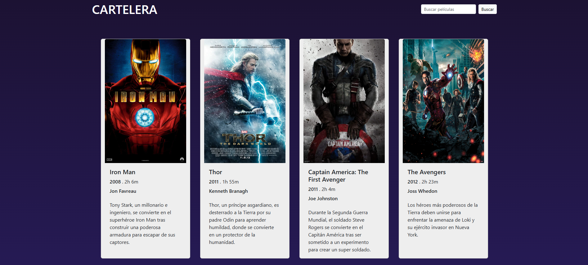
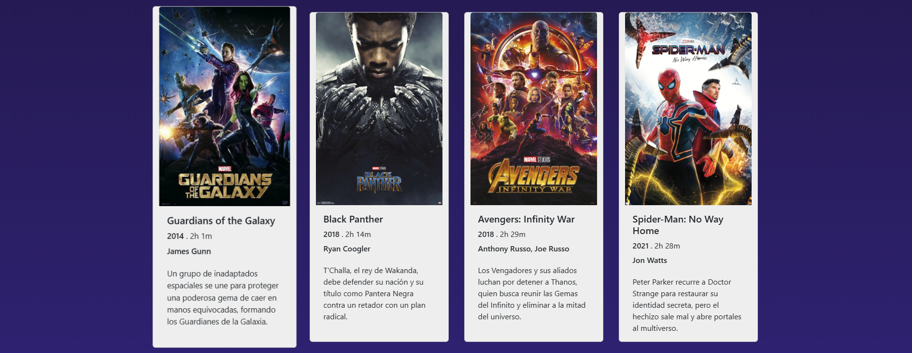
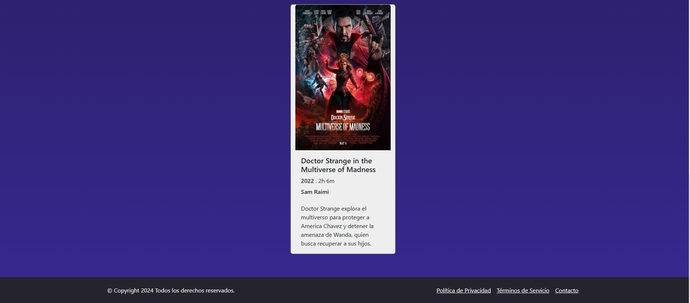

<h1> Cartelera de Películas</h1>

Este es un proyecto de cartelera de películas que muestra una lista de Peliculas de MARVEL junto con su título, imagen, año, duración, sinopsis y director.

## Características 📖

- **Visualización de películas**: Cada película tiene su imagen, título, año, duración, sinopsis y director.
- **Responsive**: El diseño es completamente responsive, por lo que se adapta a dispositivos de diferentes tamaños, como teléfonos móviles y computadoras de escritorio.

## Tecnologías utilizadas ⚙️

- **HTML5**: Estructura de la página web.
- **JavaScript**: Funcionalidades interactivas como la carga dinámica de películas y la búsqueda.
- **Bootstrap**: Framework CSS para crear una interfaz responsive.

## Screenshoots 📸

## NextSteps 👟

"Implement the movie search button, which filters by the registered movies. Add a trailer for each movie."

